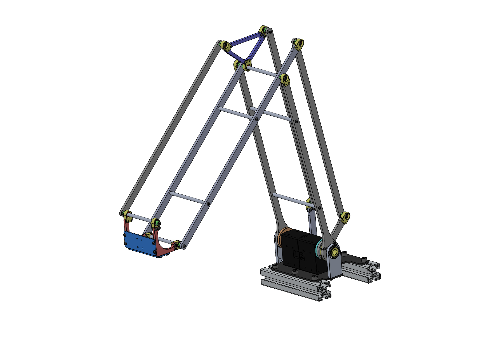
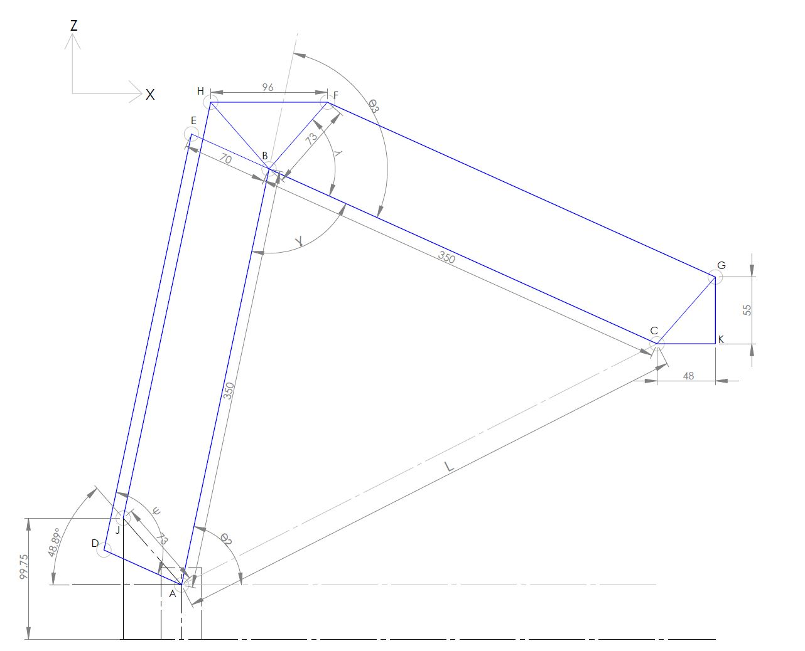
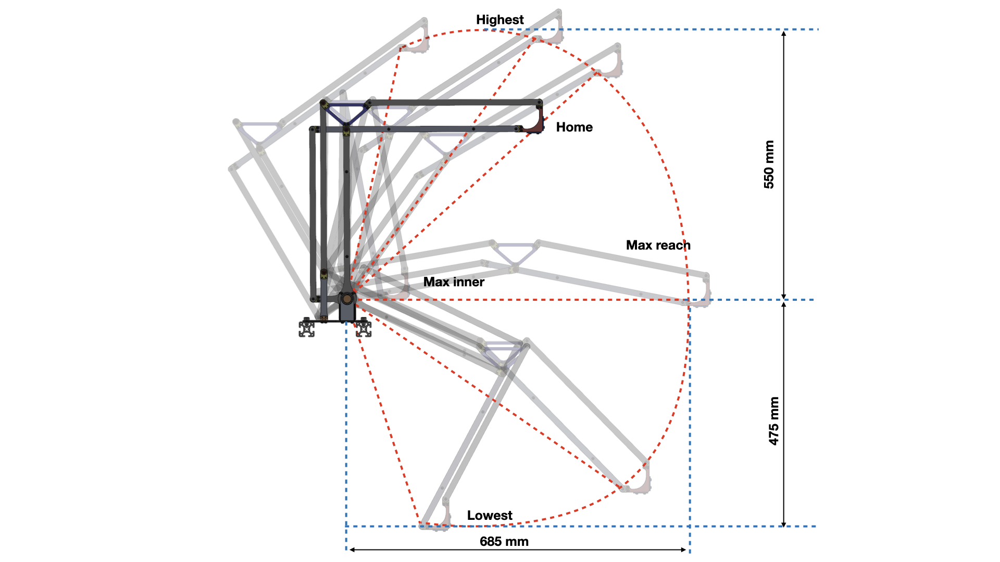

# P2D Arm 

This is a simple 2DOF Palletizer robot manipulator. It was designed for camera-lifting device using on AVATAR rover. So it doesn't need base servo motor or gripper, because the main task is to lift camera uo-down in planar to giver more camera view to the operator.



## Hardware
1. ROBOTIS Dynamixel XM540-W270-R servos 2 pieces
2. ROBOTIS U2D2 converter
3. GoPro camera (or even webcam)
4. Joystick (optional)
5. The carbon and aluminum parts

This code is based on [Dynamixel SDK](https://emanual.robotis.com/docs/en/software/dynamixel/dynamixel_sdk/overview/) because I am using their servos, so make sure you have this SDK on your environment or even put it in this directory is also fine. Joystick is an option if you want to manually control the arm, you can try it on `P2D_Joystick.py` .

## Kinematics and Workspace



This is just a planar robot XZ plane, then the inverse kinematics is pretty simple 

```
def INV(self,px,pz):

	alpha = np.arctan2(pz,px)
	L = np.sqrt(px**2 + pz**2)
	#from cosine law
	gam = np.arccos(-((L**2 - self.L2**2 - self.L3**2)/(2*self.L2*self.L3)))
	# print("gam: ", np.degrees(gam))
	#from sine law
	beta = np.arcsin(self.L3*np.sin(gam)/L)

	theta3 = -(np.pi - gam)
	theta2 = alpha + beta

	deg2 = np.degrees(theta2)
	deg3 = np.degrees(theta3)

	if m.isnan(float(deg2))  or m.isnan(float(deg3)):
		deg2 = self.prev_deg2
		deg3 = self.prev_deg3
		print("INV ERROR: Nan velue")

	self.prev_deg2 = deg2
	self.prev_deg3 = deg3

	return deg2, deg3
```

On the `Palletizer2DOF.py` class, on the INV function, please refer to image above, `L` is the artificial length from point `A` to `C` , and kinematically, the point `px,pz` is at `C`. `theta2` and `theta3` are the robot kinematic angle, but practically the motor3 is on the ground and has coaxial with motor2. If you open a Robot Manipulator text book from John J. Craig or Lung-Wen Tsai, this is a simple elbow-up configuration of 2DOF robot that you've seen there. You can try using DH-Parameters, but this geometric solution should be enough for this.



The working range of this robot is determined by the linkage and joints collision, so I am using `psi` and `lambda` angles to tell that the desired pose is possible to achieve or not. On the init of `Palletizer2DOF.py` class you will see that
```
# psi is an angle between drive link3 and idle link2
self.psi_min = 24				# deg
self.psi_max = 165				# deg
# upper triangle constant angle is a constant angle to maintain end effector parallel
self.UT_const_ang = 48.89		# deg
# lamda is an angle between main link3 and upper triangle
self.lamda_min = 15				# deg
self.lamda_max = 168			# deg
```
this is the constraint angle that would limit the motion of this arm, it comes from experimenting and observation. I was using `P2D_Kinematics.py` script to run the kinematic calculation over time to see the robot angle, kinematics angle and end-effector pose and decide which value will be used for a joint limited contrain. 


## Usage

If the robot needs to run in the application that has to be in while loop to get new data coming all the time, and not gonna delay the other process, I suggest to use `GotoPointInTime(x,z,finishedTime)` function, so it will return `True` when ever it reached the target point, you can check the example code on `P2D_Goto.py`, I made an array of target, then it would run it one by one in sequence in while loop without sleep or delay in the loop or in robot class. This will be useful for autonomous drive for example robot arm with object detection.

But if the application is to get control from user input, like joystick. Then better to use `GotoByJoystick(x,z)`, because I guess user joystick will come all the time, and you need robot to move when there is a push of stick or something. See an exampl on `P2D_Joystick.py`

You can check how it works on this [video](https://youtu.be/Dzm5CX64LOk).
